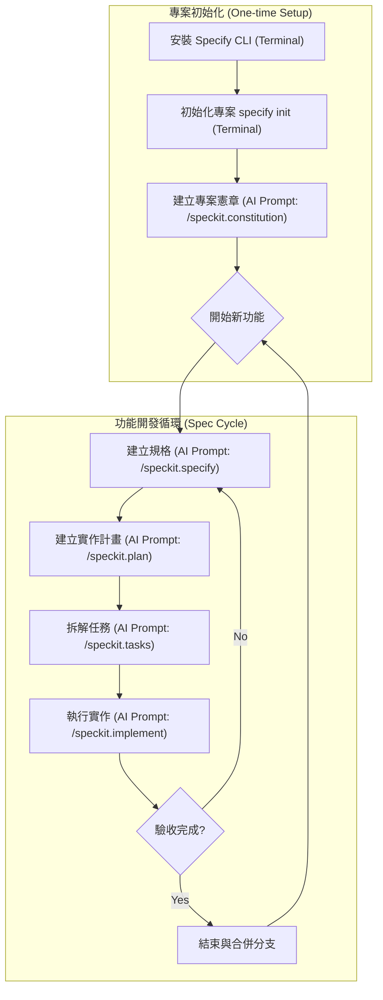

# GitHub Spec Kit

GitHub Spec Kit 是一個旨在幫助開發者開始**規格驅動開發 (Spec-Driven Development)** 的工具包。它利用 AI Agent 的能力，通過結構化的流程將想法轉化為高品質的軟體。

1.  **官方網站**: [https://github.com/github/spec-kit](https://github.com/github/spec-kit)

---

## 核心概念 (Concepts)

GitHub Spec Kit 的核心哲學在於**規格驅動 (Spec-Driven)**，強調在編寫程式碼之前先明確定義「做什麼 (What)」而非「怎麼做 (How)」。

- **意圖驅動開發 (Intent-driven development)**：優先定義規格，確保開發方向正確。
- **豐富的規格建立 (Rich specification creation)**：使用護欄 (guardrails) 和組織原則來建立詳細的規格，而非簡單的提示。
- **多步驟持續優化 (Multi-step refinement)**：避免一次性生成程式碼，而是通過多個階段（原則 -> 規格 -> 計畫 -> 任務 -> 實作）逐步完善。
- **AI 深度整合 (Advanced AI capabilities)**：依賴先進的 AI 模型來解讀規格並執行實作。

---

## 安裝指南 (Installation)

Spec Kit 需要 Python 環境，並建議使用 `uv` 進行套件管理。

### 前置需求 (Prerequisites)

- **Python 3.11+**
- **Git**
- **uv** (Python 套件管理器)
- **支援的 AI Agent** (如 Claude Code, Gemini 等)

### Windows (使用 WSL) 與 macOS 安裝

建議在 Windows 上使用 WSL (Windows Subsystem for Linux)，這裡統一提供基於 Python 和 `uv` 的安裝方式，這在 macOS 和 WSL 上是通用的。

#### 1. 安裝 uv

如果尚未安裝 `uv`，請先執行以下指令：

**macOS / Linux (WSL):**

```bash
curl -LsSf https://astral.sh/uv/install.sh | sh
```

#### 2. 安裝 Specify CLI

建議使用 `uv tool` 進行全域安裝，這樣可以在任何地方使用 `specify` 指令。

```bash
uv tool install specify-cli --from git+https://github.com/github/spec-kit.git
```

安裝完成後，您可以使用 `specify check` 來確認安裝狀態。

---

## 工作流程 (Workflow)

Spec Kit 的核心流程分為「專案初始化」與「功能開發循環」兩個部分。

### 1. 專案初始化與原則建立 (一次性工作)

這部分只需在專案開始時執行一次。主要是安裝工具、初始化設定，以及定義專案的「憲章 (Constitution)」。憲章將作為後續所有開發的最高指導原則。

### 2. 功能開發循環 (Spec Cycle)

每個新功能或修改都應該開啟一個新的 Spec Cycle (通常配合 git branch)。這是一個從規格到實作的標準化循環。

### 流程圖



### 詳細步驟與指令類型對照

請注意，本工具包使用兩種不同類型的指令：

1.  **💻 終端機指令 (Terminal Command)**:

    - 在系統的 Shell (bash/zsh/powershell) 中執行。
    - 通常以 `uv` 或 `specify` 開頭。
    - 用途：安裝工具、初始化專案結構。

2.  **🤖 AI 對話指令 (AI Agent Prompt)**:
    - 在 AI 編輯器 (如 Cursor, Claude Code) 的對話視窗中輸入。
    - 以 `/speckit.` 開頭的 Slash Command，或者是彈出式選單中的選項。
    - 用途：生成規格、規劃架構、執行程式碼修改。

#### 步驟詳細說明

**Phase 1: 初始化 (One-time)**

1.  **初始化專案** `Terminal Command`
    在專案根目錄執行，建立設定檔與目錄結構。

    ```bash
    specify init . --ai claude
    # 這是終端機指令，請在 Terminal 中執行
    ```

2.  **建立專案憲章 (Constitution)** `AI Agent Prompt`
    這是專案的「憲法」。定義程式碼風格、測試規範等。**這是一次性的設定**，除非團隊規範改變，否則不需重複執行。
    - **操作方式**: 在 AI 對話框輸入 `/speckit.constitution`
    - **輸入範例**:
      > "/speckit.constitution Create principles focused on clean architecture, 100% test coverage for utils, and using functional components."

**Phase 2: 功能開發 (Repeating Cycle)**

當您要開發新功能 (例如: "新增使用者登入") 時，請建立新 branch 並開始此循環：

3.  **建立規格 (Spec)** `AI Agent Prompt`
    描述「要做什麼 (What)」。

    - **操作方式**: 在 AI 對話框輸入 `/speckit.specify`
    - **輸入範例**:
      > "/speckit.specify Create a login page with email and password. It should support OAuth using Google."

4.  **建立計畫 (Plan)** `AI Agent Prompt`
    描述「怎麼做 (How)」，包含技術選型與架構。

    - **操作方式**: 在 AI 對話框輸入 `/speckit.plan`
    - **輸入範例**:
      > "/speckit.plan Use Firebase Auth for the backend and React Hook Form for the frontend validation."

5.  **拆解任務 (Tasks)** `AI Agent Prompt`
    將計畫轉為可執行的步驟清單 (`tasks.md`)。

    - **操作方式**: 在 AI 對話框輸入 `/speckit.tasks`
    - **作用**: AI 會自動分析 Plan 並生成有序的任務列表。

6.  **執行實作 (Implement)** `AI Agent Prompt`
    AI 根據任務清單寫程式碼。
    - **操作方式**: 在 AI 對話框輸入 `/speckit.implement`
    - **作用**: AI 會讀取 `tasks.md`，並逐一執行任務，直到完成或遇到困難詢問您。

---

## 檔案結構 (File Structure)

Spec Kit 會在您的專案中維護特定的目錄結構來存儲規格和記憶。

```text
Project_Root/
├── .specify/
│   ├── memory/
│   │   ├── constitution.md   # 專案憲章 (全域共用，由 /speckit.constitution 產生)
│   │   └── ...
├── specs/                    # 規格文件存放處
│   ├── feature_name/         # 依據功能/Branch 區分的規格目錄
│   │   ├── spec.md           # 功能規格 (由 /speckit.specify 產生)
│   │   ├── plan.md           # 實作計畫 (由 /speckit.plan 產生)
│   │   └── tasks.md          # 任務清單 (由 /speckit.tasks 產生)
├── src/                      # 您的源代碼
└── ...
```
