# GitHub Spec Kit

GitHub Spec Kit 是一個旨在幫助開發者開始**規格驅動開發 (Spec-Driven Development)** 的工具包。它利用 AI Agent 的能力，通過結構化的流程將想法轉化為高品質的軟體。

1.  **官方網站**: [https://github.com/github/spec-kit](https://github.com/github/spec-kit)

---

## 核心概念 (Concepts)

GitHub Spec Kit 的核心哲學在於**規格驅動 (Spec-Driven)**，強調在編寫程式碼之前先明確定義「做什麼 (What)」而非「怎麼做 (How)」。

- **意圖驅動開發 (Intent-driven development)**：優先定義規格，確保開發方向正確。
- **豐富的規格建立 (Rich specification creation)**：使用護欄 (guardrails) 和組織原則來建立詳細的規格，而非簡單的提示。
- **多步驟持續優化 (Multi-step refinement)**：避免一次性生成程式碼，而是通過多個階段（原則 -> 規格 -> 計畫 -> 任務 -> 實作）逐步完善。
- **AI 深度整合 (Advanced AI capabilities)**：依賴先進的 AI 模型來解讀規格並執行實作。

---

## 安裝指南 (Installation)

Spec Kit 需要 Python 環境，並建議使用 `uv` 進行套件管理。

### 前置需求 (Prerequisites)

- **Python 3.11+**
- **Git**
- **uv** (Python 套件管理器)
- **支援的 AI Agent** (如 Claude Code, Gemini 等)

### Windows (使用 WSL) 與 macOS 安裝

建議在 Windows 上使用 WSL (Windows Subsystem for Linux)，這裡統一提供基於 Python 和 `uv` 的安裝方式，這在 macOS 和 WSL 上是通用的。

#### 1. 安裝 uv

如果尚未安裝 `uv`，請先執行以下指令：

**macOS / Linux (WSL):**

```bash
curl -LsSf https://astral.sh/uv/install.sh | sh
```

#### 2. 安裝 Specify CLI

建議使用 `uv tool` 進行全域安裝，這樣可以在任何地方使用 `specify` 指令。

```bash
uv tool install specify-cli --from git+https://github.com/github/spec-kit.git
```

安裝完成後，您可以使用 `specify check` 來確認安裝狀態。

---

## 工作流程 (Workflow)

Spec Kit 的核心流程分為「專案初始化」與「功能開發循環」兩個部分。

### 1. 專案初始化與原則建立 (一次性工作)

這部分只需在專案開始時執行一次。主要是安裝工具、初始化設定，以及定義專案的「憲章 (Constitution)」。憲章將作為後續所有開發的最高指導原則。

### 2. 功能開發循環 (Spec Cycle)

每個新功能或修改都應該開啟一個新的 Spec Cycle (通常配合 git branch)。這是一個從規格到實作的標準化循環。

### 流程圖

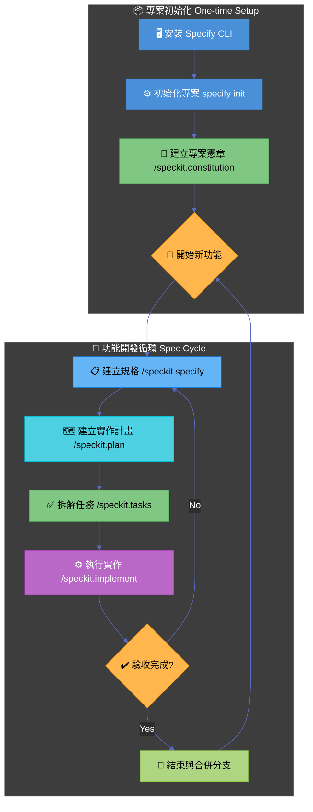

### 詳細步驟與指令類型對照

請注意，本工具包使用兩種不同類型的指令：

1.  **💻 終端機指令 (Terminal Command)**:

    - 在系統的 Shell (bash/zsh/powershell) 中執行。
    - 通常以 `uv` 或 `specify` 開頭。
    - 用途：安裝工具、初始化專案結構。

2.  **🤖 AI 對話指令 (AI Agent Prompt)**:
    - 在 AI 編輯器 (如 Cursor, Claude Code) 的對話視窗中輸入。
    - 以 `/speckit.` 開頭的 Slash Command，或者是彈出式選單中的選項。
    - 用途：生成規格、規劃架構、執行程式碼修改。

#### 步驟詳細說明

**Phase 1: 初始化 (One-time)**

1.  **初始化專案** `Terminal Command`
    在專案根目錄執行，建立設定檔與目錄結構。

    ```bash
    specify init . --ai claude
    # 這是終端機指令，請在 Terminal 中執行
    ```

2.  **建立專案憲章 (Constitution)** `AI Agent Prompt`
    這是專案的「憲法」。定義程式碼風格、測試規範等。**這是一次性的設定**，除非團隊規範改變，否則不需重複執行。
    - **操作方式**: 在 AI 對話框輸入 `/speckit.constitution`
    - **輸入範例**:
      > "/speckit.constitution Create principles focused on clean architecture, 100% test coverage for utils, and using functional components."

**Phase 2: 功能開發 (Repeating Cycle)**

當您要開發新功能 (例如: "新增使用者登入") 時，請建立新 branch 並開始此循環：

3.  **建立規格 (Spec)** `AI Agent Prompt`
    描述「要做什麼 (What)」。

    - **操作方式**: 在 AI 對話框輸入 `/speckit.specify`
    - **輸入範例**:
      > "/speckit.specify Create a login page with email and password. It should support OAuth using Google."

4.  **建立計畫 (Plan)** `AI Agent Prompt`
    描述「怎麼做 (How)」，包含技術選型與架構。

    - **操作方式**: 在 AI 對話框輸入 `/speckit.plan`
    - **輸入範例**:
      > "/speckit.plan Use Firebase Auth for the backend and React Hook Form for the frontend validation."

5.  **拆解任務 (Tasks)** `AI Agent Prompt`
    將計畫轉為可執行的步驟清單 (`tasks.md`)。

    - **操作方式**: 在 AI 對話框輸入 `/speckit.tasks`
    - **作用**: AI 會自動分析 Plan 並生成有序的任務列表。

6.  **執行實作 (Implement)** `AI Agent Prompt`
    AI 根據任務清單寫程式碼。
    - **操作方式**: 在 AI 對話框輸入 `/speckit.implement`
    - **作用**: AI 會讀取 `tasks.md`，並逐一執行任務，直到完成或遇到困難詢問您。

---

## 檔案結構 (File Structure)

Spec Kit 會在您的專案中維護特定的目錄結構來存儲規格和記憶。

```text
Project_Root/
├── .specify/
│   ├── memory/
│   │   ├── constitution.md   # 專案憲章 (全域共用，由 /speckit.constitution 產生)
│   │   └── ...
├── specs/                    # 規格文件存放處
│   ├── feature_name/         # 依據功能/Branch 區分的規格目錄
│   │   ├── spec.md           # 功能規格 (由 /speckit.specify 產生)
│   │   ├── plan.md           # 實作計畫 (由 /speckit.plan 產生)
│   │   └── tasks.md          # 任務清單 (由 /speckit.tasks 產生)
├── src/                      # 您的源代碼
└── ...
```

---

## 進階架構分析 (Advanced Architecture Analysis)

本節深入分析 GitHub Spec Kit 的完整架構，包含所有檔案的職責與相互關係。

### 系統運作模式

GitHub Spec Kit 結合兩種運作模式：

1. **Specify CLI** (終端機工具) - 用於專案初始化
2. **AI Agent 指令** (對話式指令) - 用於功能開發循環

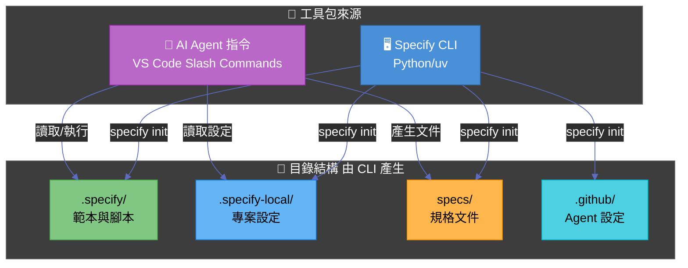

---

## 完整目錄結構詳解 (Complete Directory Structure)

### 目錄總覽

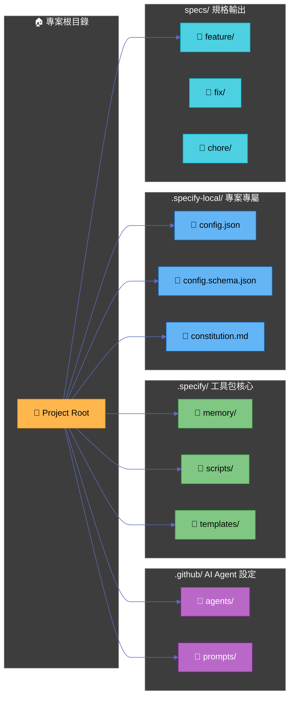

### 詳細目錄樹狀結構

```text
Project_Root/
├── .github/
│   ├── agents/                              # AI Agent 邏輯定義
│   │   ├── speckit.constitution.agent.md    # 憲章建立 Agent
│   │   ├── speckit.specify.agent.md         # 規格建立 Agent
│   │   ├── speckit.clarify.agent.md         # 需求釐清 Agent
│   │   ├── speckit.plan.agent.md            # 技術規劃 Agent
│   │   ├── speckit.tasks.agent.md           # 任務拆解 Agent
│   │   ├── speckit.checklist.agent.md       # 檢查清單 Agent
│   │   ├── speckit.analyze.agent.md         # 一致性分析 Agent
│   │   ├── speckit.implement.agent.md       # 程式實作 Agent
│   │   └── speckit.taskstoissues.agent.md   # 轉為 Issue Agent
│   └── prompts/                             # Slash Command 觸發器
│       ├── speckit.constitution.prompt.md
│       ├── speckit.specify.prompt.md
│       ├── speckit.clarify.prompt.md
│       ├── speckit.plan.prompt.md
│       ├── speckit.tasks.prompt.md
│       ├── speckit.checklist.prompt.md
│       ├── speckit.analyze.prompt.md
│       ├── speckit.implement.prompt.md
│       └── speckit.taskstoissues.prompt.md
├── .specify/
│   ├── memory/
│   │   └── constitution-template.md         # 憲章範本
│   ├── scripts/
│   │   └── powershell/
│   │       ├── common.ps1                   # 共用函式庫
│   │       ├── create-new-feature.ps1       # 建立新功能分支
│   │       ├── check-prerequisites.ps1      # 前置條件檢查
│   │       ├── setup-plan.ps1               # 設定計畫檔案
│   │       └── update-agent-context.ps1     # 更新 Agent 上下文
│   └── templates/
│       ├── spec-template.md                 # 規格書範本
│       ├── plan-template.md                 # 計畫範本
│       ├── tasks-template.md                # 任務範本
│       ├── checklist-template.md            # 檢查清單範本
│       └── agent-file-template.md           # Agent 上下文範本
├── .specify-local/
│   ├── config.json                          # 專案語系與輸出設定
│   ├── config.schema.json                   # 設定檔 JSON Schema
│   └── constitution.md                      # 專案開發憲章
└── specs/
    ├── feature/                             # 功能類型規格
    │   └── [###-feature-name]/
    │       ├── spec.md                      # 功能規格書
    │       ├── plan.md                      # 技術計畫
    │       ├── tasks.md                     # 任務清單
    │       ├── research.md                  # 技術研究
    │       ├── data-model.md                # 資料模型
    │       ├── contracts/                   # API 合約
    │       ├── checklists/                  # 檢查清單
    │       └── docs/                        # 補充文件
    ├── fix/                                 # 修復類型規格
    ├── chore/                               # 維護類型規格
    ├── docs/                                # 文件類型規格
    ├── refactor/                            # 重構類型規格
    ├── test/                                # 測試類型規格
    ├── style/                               # 樣式類型規格
    └── perf/                                # 效能類型規格
```

---

## 檔案職責詳解 (File Responsibilities)

### `.github/prompts/` - Prompt 觸發器

這些檔案是「橋接器」，內容極為簡單（僅指向對應的 agent），讓 VS Code 能識別 Slash Command。

| 檔案 | 用途 | 來源 |
|------|------|------|
| `speckit.specify.prompt.md` | 觸發 `/speckit.specify` 指令 | Specify CLI |
| `speckit.plan.prompt.md` | 觸發 `/speckit.plan` 指令 | Specify CLI |
| `speckit.tasks.prompt.md` | 觸發 `/speckit.tasks` 指令 | Specify CLI |
| `speckit.implement.prompt.md` | 觸發 `/speckit.implement` 指令 | Specify CLI |
| `speckit.constitution.prompt.md` | 觸發 `/speckit.constitution` 指令 | Specify CLI |
| `speckit.clarify.prompt.md` | 觸發 `/speckit.clarify` 指令 | Specify CLI |
| `speckit.analyze.prompt.md` | 觸發 `/speckit.analyze` 指令 | Specify CLI |
| `speckit.checklist.prompt.md` | 觸發 `/speckit.checklist` 指令 | Specify CLI |
| `speckit.taskstoissues.prompt.md` | 觸發 `/speckit.taskstoissues` 指令 | Specify CLI |

**範例內容**:
```yaml
---
agent: speckit.specify
---
```

### `.github/agents/` - AI Agent 定義 (核心邏輯)

```mermaid
%%{init: {'theme': 'base', 'themeVariables': { 'primaryColor': '#4a90d9', 'primaryTextColor': '#ffffff', 'primaryBorderColor': '#2d5a87', 'lineColor': '#5c6bc0', 'secondaryColor': '#81c784', 'tertiaryColor': '#fff59d', 'background': '#1e1e1e', 'mainBkg': '#2d2d2d', 'nodeBorder': '#888888', 'clusterBkg': '#3d3d3d', 'clusterBorder': '#666666', 'titleColor': '#ffffff', 'edgeLabelBackground': '#2d2d2d'}}}%%
flowchart TD
    subgraph AGENTS["🤖 Agent 檔案群"]
        CONST["📜 speckit.constitution<br/>憲章建立"]
        SPEC["📋 speckit.specify<br/>規格建立"]
        CLARIFY["❓ speckit.clarify<br/>需求釐清"]
        PLAN["🗺️ speckit.plan<br/>技術規劃"]
        TASKS["✅ speckit.tasks<br/>任務拆解"]
        CHECK["📝 speckit.checklist<br/>檢查清單"]
        ANALYZE["🔍 speckit.analyze<br/>一致性分析"]
        IMPL["⚙️ speckit.implement<br/>程式實作"]
        ISSUES["🎫 speckit.taskstoissues<br/>轉為 Issue"]
    end
    
    CONST -->|定義原則| SPEC
    SPEC -->|需要釐清| CLARIFY
    CLARIFY -->|釐清完成| SPEC
    SPEC -->|規格完成| PLAN
    PLAN -->|規劃完成| TASKS
    TASKS -->|任務拆解| CHECK
    CHECK -->|檢查完成| ANALYZE
    ANALYZE -->|分析通過| IMPL
    TASKS -->|同步| ISSUES

    style CONST fill:#81c784,stroke:#4caf50,color:#000
    style SPEC fill:#64b5f6,stroke:#1976d2,color:#000
    style CLARIFY fill:#ffb74d,stroke:#ff9800,color:#000
    style PLAN fill:#4dd0e1,stroke:#00bcd4,color:#000
    style TASKS fill:#aed581,stroke:#8bc34a,color:#000
    style CHECK fill:#ce93d8,stroke:#9c27b0,color:#000
    style ANALYZE fill:#f48fb1,stroke:#e91e63,color:#000
    style IMPL fill:#ba68c8,stroke:#9c27b0,color:#fff
    style ISSUES fill:#90a4ae,stroke:#607d8b,color:#000
```

#### 各 Agent 詳細職責

| Agent | 主要職責 | 輸入 | 輸出 | Handoff (接續) |
|-------|---------|------|------|----------------|
| **speckit.constitution** | 建立/更新專案憲章（開發原則） | 使用者描述 | `.specify-local/constitution.md` | → speckit.specify |
| **speckit.specify** | 從自然語言建立功能規格書 | 功能描述 | `specs/[feature]/spec.md`<br/>`checklists/requirements.md` | → speckit.plan 或 speckit.clarify |
| **speckit.clarify** | 識別並解決規格中的模糊之處 | spec.md | 更新後的 spec.md | → speckit.plan |
| **speckit.plan** | 建立技術實作計畫 | spec.md + constitution | `plan.md`, `research.md`,<br/>`data-model.md`, `contracts/` | → speckit.tasks |
| **speckit.tasks** | 將計畫拆解為可執行任務清單 | plan.md + spec.md | `tasks.md` | → speckit.analyze 或 speckit.implement |
| **speckit.checklist** | 產生特定領域的檢查清單 | 使用者需求 + spec/plan | `checklists/[domain].md` | - |
| **speckit.analyze** | 跨文件一致性與品質分析 | spec.md + plan.md + tasks.md | 分析報告（不修改檔案） | → speckit.implement |
| **speckit.implement** | 依任務清單執行程式碼實作 | tasks.md + plan.md | 程式碼檔案 | - |
| **speckit.taskstoissues** | 將任務轉換為 GitHub Issues | tasks.md | GitHub Issues | - |

### `.specify/scripts/powershell/` - 腳本工具

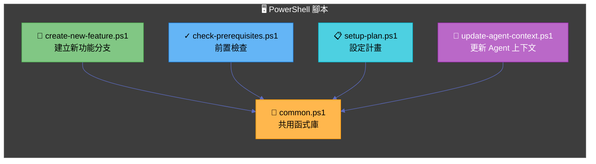

| 腳本 | 用途 | 呼叫者 | 來源 |
|------|------|--------|------|
| `common.ps1` | 提供共用函式 (Get-RepoRoot, Get-CurrentBranch, Get-FeaturePathsEnv) | 所有其他腳本 | Specify CLI |
| `create-new-feature.ps1` | 建立新功能分支與目錄結構 | speckit.specify agent | Specify CLI |
| `check-prerequisites.ps1` | 驗證必要檔案是否存在 | 多個 agent (plan, tasks, implement, analyze, checklist) | Specify CLI |
| `setup-plan.ps1` | 複製 plan-template 並設定路徑 | speckit.plan agent | Specify CLI |
| `update-agent-context.ps1` | 更新 AI 專用指引檔 (CLAUDE.md, COPILOT.md 等) | speckit.plan agent | Specify CLI |

### `.specify/templates/` - 文件範本

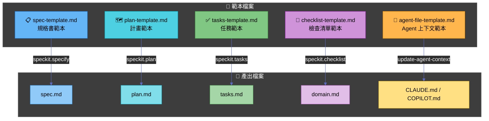

| 範本 | 用途 | 使用時機 | 來源 |
|------|------|----------|------|
| `spec-template.md` | 定義規格書結構（使用者情境、需求、成功標準） | `/speckit.specify` | Specify CLI |
| `plan-template.md` | 定義技術計畫結構（技術選型、架構、階段） | `/speckit.plan` | Specify CLI |
| `tasks-template.md` | 定義任務清單格式（階段、任務、相依性） | `/speckit.tasks` | Specify CLI |
| `checklist-template.md` | 定義檢查清單格式 | `/speckit.checklist` | Specify CLI |
| `agent-file-template.md` | AI 上下文檔案範本 | `update-agent-context.ps1` | Specify CLI |

### `.specify-local/` - 專案專屬設定

| 檔案 | 用途 | 來源 |
|------|------|------|
| `config.json` | 專案語系與輸出格式設定 | Specify CLI (初始化時產生) |
| `config.schema.json` | config.json 的 JSON Schema | Specify CLI |
| `constitution.md` | 專案開發憲章（原則與規範） | `/speckit.constitution` 產生 |

**config.json 範例**:
```json
{
  "locale": {
    "language": "zh-TW",
    "displayName": "繁體中文（台灣）"
  },
  "output": {
    "dateFormat": "yyyy-MM-dd",
    "documentLanguage": "zh-TW",
    "codeComments": "zh-TW"
  }
}
```

### `specs/` - 規格輸出目錄

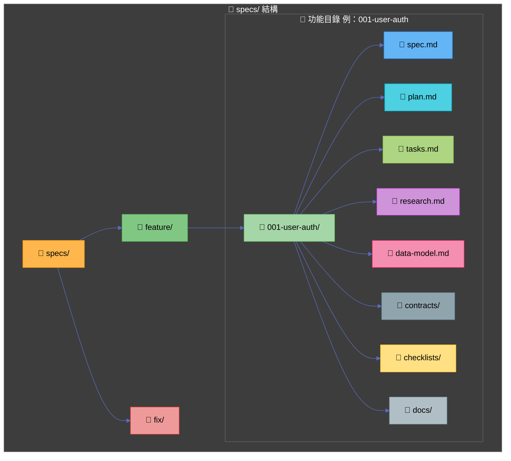

---

## 完整工作流程詳解 (Complete Workflow Detail)

### 階段一：專案初始化 (一次性)

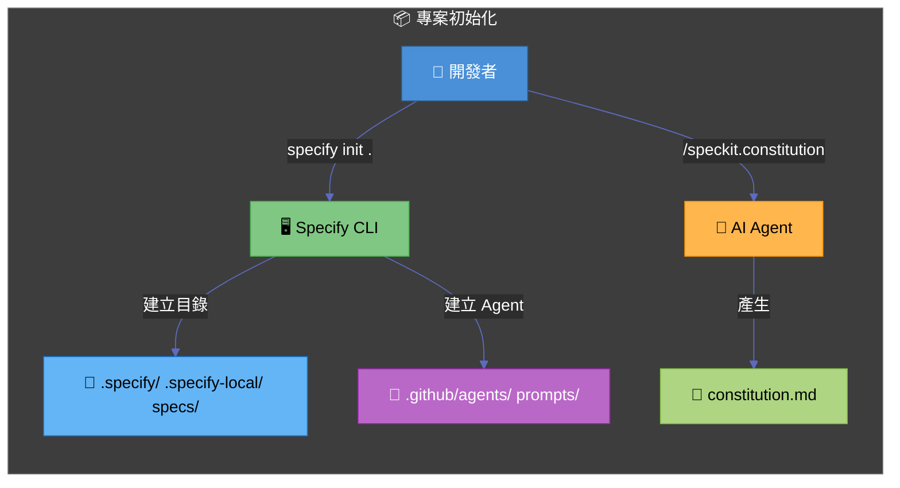

### 階段二：功能開發循環 (重複執行)

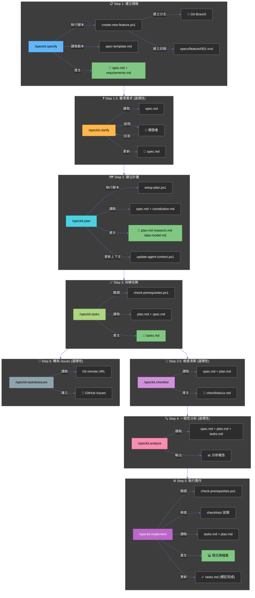

---

## 指令與腳本對應表 (Command-Script Mapping)

```mermaid
%%{init: {'theme': 'base', 'themeVariables': { 'primaryColor': '#4a90d9', 'primaryTextColor': '#ffffff', 'primaryBorderColor': '#2d5a87', 'lineColor': '#5c6bc0', 'secondaryColor': '#81c784', 'tertiaryColor': '#fff59d', 'background': '#1e1e1e', 'mainBkg': '#2d2d2d', 'nodeBorder': '#888888', 'clusterBkg': '#3d3d3d', 'clusterBorder': '#666666', 'titleColor': '#ffffff', 'edgeLabelBackground': '#2d2d2d'}}}%%
flowchart TB
    subgraph CMD["🤖 AI Agent 指令"]
        CMD_CONST["/speckit.constitution"]
        CMD_SPEC["/speckit.specify"]
        CMD_CLARIFY["/speckit.clarify"]
        CMD_PLAN["/speckit.plan"]
        CMD_TASKS["/speckit.tasks"]
        CMD_CHECK["/speckit.checklist"]
        CMD_ANALYZE["/speckit.analyze"]
        CMD_IMPL["/speckit.implement"]
        CMD_ISSUES["/speckit.taskstoissues"]
    end
    
    subgraph PS["🖥️ PowerShell 腳本"]
        PS_CREATE["create-new-feature.ps1"]
        PS_CHECK["check-prerequisites.ps1"]
        PS_SETUP["setup-plan.ps1"]
        PS_UPDATE["update-agent-context.ps1"]
    end
    
    CMD_SPEC -->|建立分支與目錄| PS_CREATE
    CMD_CLARIFY -->|驗證 spec.md 存在| PS_CHECK
    CMD_PLAN -->|設定計畫檔案| PS_SETUP
    CMD_PLAN -->|更新 Agent 上下文| PS_UPDATE
    CMD_TASKS -->|驗證前置條件| PS_CHECK
    CMD_CHECK -->|驗證前置條件| PS_CHECK
    CMD_ANALYZE -->|驗證所有文件| PS_CHECK
    CMD_IMPL -->|驗證任務存在| PS_CHECK
    CMD_ISSUES -->|驗證任務存在| PS_CHECK

    style CMD_CONST fill:#81c784,stroke:#4caf50,color:#000
    style CMD_SPEC fill:#64b5f6,stroke:#1976d2,color:#000
    style CMD_CLARIFY fill:#ffb74d,stroke:#ff9800,color:#000
    style CMD_PLAN fill:#4dd0e1,stroke:#00bcd4,color:#000
    style CMD_TASKS fill:#aed581,stroke:#8bc34a,color:#000
    style CMD_CHECK fill:#ce93d8,stroke:#9c27b0,color:#000
    style CMD_ANALYZE fill:#f48fb1,stroke:#e91e63,color:#000
    style CMD_IMPL fill:#ba68c8,stroke:#9c27b0,color:#fff
    style CMD_ISSUES fill:#90a4ae,stroke:#607d8b,color:#000
    style PS_CREATE fill:#fff59d,stroke:#fdd835,color:#000
    style PS_CHECK fill:#ffe082,stroke:#ffca28,color:#000
    style PS_SETUP fill:#ffcc80,stroke:#ffa726,color:#000
    style PS_UPDATE fill:#ffab91,stroke:#ff7043,color:#000
```

---

## 來源分類總覽 (Source Classification)

### 由 Specify CLI 產生 (透過 `specify init`)

| 類別 | 檔案/目錄 | 說明 |
|------|-----------|------|
| **Agent 設定** | `.github/agents/*.agent.md` | AI Agent 邏輯定義 |
| **Prompt 觸發** | `.github/prompts/*.prompt.md` | Slash Command 觸發器 |
| **腳本** | `.specify/scripts/powershell/*.ps1` | 自動化腳本 |
| **範本** | `.specify/templates/*.md` | 文件範本 |
| **記憶** | `.specify/memory/constitution-template.md` | 憲章範本 |
| **設定** | `.specify-local/config.json` | 專案設定 |
| **Schema** | `.specify-local/config.schema.json` | 設定驗證 |

### 由 AI Agent 產生 (透過 Slash Commands)

| 指令 | 產出檔案 | 目標目錄 |
|------|----------|----------|
| `/speckit.constitution` | `constitution.md` | `.specify-local/` |
| `/speckit.specify` | `spec.md`, `checklists/requirements.md` | `specs/[type]/[feature]/` |
| `/speckit.clarify` | 更新 `spec.md` | `specs/[type]/[feature]/` |
| `/speckit.plan` | `plan.md`, `research.md`, `data-model.md`, `contracts/` | `specs/[type]/[feature]/` |
| `/speckit.tasks` | `tasks.md` | `specs/[type]/[feature]/` |
| `/speckit.checklist` | `[domain].md` | `specs/[type]/[feature]/checklists/` |
| `/speckit.analyze` | 分析報告 (僅輸出，不產生檔案) | - |
| `/speckit.implement` | 程式碼檔案 + 更新 `tasks.md` | 專案目錄 |
| `/speckit.taskstoissues` | GitHub Issues | GitHub |

---

## 檔案相依性圖 (File Dependency Graph)

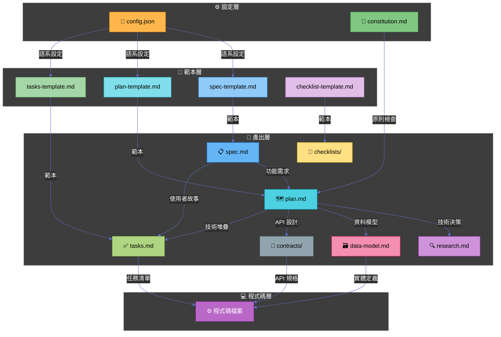

---

## 設計原則總結 (Design Principles Summary)

### 工具分工

| 層級 | 工具 | 職責 |
|------|------|------|
| **初始化** | Specify CLI (`specify init`) | 建立目錄結構、複製範本、設定 Agent |
| **開發循環** | AI Agent (Slash Commands) | 執行規格驅動開發流程 |
| **自動化** | PowerShell 腳本 | 分支管理、前置檢查、上下文更新 |

### 核心設計原則

1. **分層關注 (Separation of Concerns)** - 每個階段有明確的輸入輸出
2. **範本驅動 (Template-Driven)** - 所有產出都基於標準化範本
3. **可追溯性 (Traceability)** - 從需求到程式碼的完整追蹤
4. **品質閘門 (Quality Gates)** - 每階段都有驗證機制
5. **AI 協作 (AI Collaboration)** - 人類定義「做什麼」，AI 協助「怎麼做」
