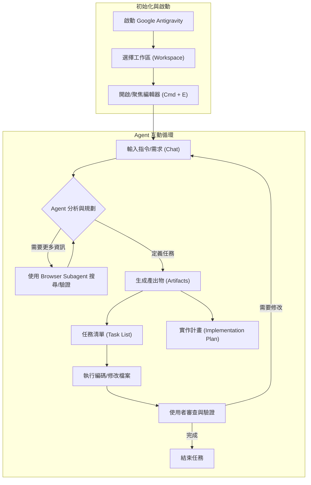

# Google Antigravity

Google Antigravity 是一個強大的 AI Agent 編碼助手，旨在改變軟體的建構方式 ("Build the new way")。它由 Google DeepMind 團隊設計，專注於進階的 Agentic Coding，透過深度整合的工具與工作流程來協助開發者。

1.  **官方文件**: [https://antigravity.google/docs/get-started](https://antigravity.google/docs/get-started)
2.  **下載連結**: [https://antigravity.google/download](https://antigravity.google/download)

---

## 核心概念 (Concepts)

Google Antigravity 的核心在於利用 AI Agent 來驅動開發流程，涵蓋了從對話到實作的各個層面。

- **Agent 驅動 (Agent-Driven)**：以強大的 AI 模型為核心，理解並執行複雜的編碼任務。
- **模型與設定 (Models & Settings)**：支援多種模型配置，並可調整 Agent 的行為模式。
- **規則與工作流程 (Rules / Workflows)**：允許定義特定的規則與工作流程，讓 Agent 遵循最佳實踐或特定專案規範。
- **瀏覽器子代理 (Browser Subagent)**：具備操控瀏覽器的能力，可自行搜尋文件、驗證網頁結果。
- **MCP 工具整合 (MCP - Model Context Protocol)**：透過 MCP 擴充 Agent 的能力，連接更多外部資源。
- **產出物 (Artifacts)**：自動生成任務清單 (Task List)、實作計畫 (Implementation Plan) 等結構化產出。
- **安全模式 (Secure Mode)**：確保企業級開發的安全性。

---

## 安裝指南 (Installation)

Google Antigravity 支援主流的作業系統，請前往官方頁面下載。

### 系統需求 (System Requirements)

- **macOS**:
  - 支援 Apple 提供安全更新的版本 (通常是目前版本及前兩個版本)。
  - 最低需求：macOS 12 (Monterey)。
  - **注意**：不支援 x86 架構 (僅支援 Apple Silicon)。
- **Windows**:
  - Windows 10 (64 bit) 或更高版本。
- **Linux**:
  - 需要 glibc >= 2.28, glibcxx >= 3.4.25。
  - 範例發行版：Ubuntu 20, Debian 10, Fedora 36, RHEL 8。

應用程式會在有可用更新時自動提示 (Restart to Update)。

---

## 工作流程 (Workflow)

Antigravity 的工作流程強調從「聚焦編輯器」開始，透過與 Agent 的對話來驅動開發。

### 基本操作 (Basic Navigation)

- **開啟編輯器 (Focus Editor)**：您可以透過 Agent Manager 的選單，或是使用鍵盤快捷鍵 `Cmd + E` 來快速聚焦並開啟編輯器。
- **對話與執行 (Chat & Execute)**：在編輯器中與 Agent 對話，下達指令或詢問問題。

### 流程圖 (Mermaid)



---

## 常見限制與注意事項 (Limitations & Notes)

雖然 Google Antigravity 提供強大的 AI 編碼能力，但在目前的版本（預覽版）中，仍有一些功能限制：

- **授權擴充功能 (Licensed Extensions)**: 目前不支援安裝需要特定授權的擴充功能，例如 Microsoft 官方的 **C# Dev Kit**。這意味著某些專屬於這些擴充功能的進階 IDE 功能可能無法使用。
- **偵錯功能 (Debugging)**: Antigravity 本身目前並**不具備**傳統 IDE 的偵錯介面功能。
  - 不支援設置中斷點 (Breakpoints)。
  - 不支援單步執行 (Step-by-step execution)。
  - **建議做法**: 使用傳統 IDE (如 VS Code 或 Visual Studio) 進行偵錯，或是請 Agent 透過分析程式日誌 (Logs) 與代碼邏輯來協助排查問題。

---

## 檔案與產出物結構 (Structure & Artifacts)

雖然 Antigravity 直接在您的專案目錄中運作，但它會維護一系列的「產出物 (Artifacts)」來追蹤進度與狀態。這些通常在介面中可見。

```text
Project_Root/ (您的專案根目錄)
├── (您的原始碼檔案)
├── .gemini/ (或類似的系統目錄，用於存儲 Agent 記憶與狀態)
│   ├── brain/              # Agent 的長期記憶
│   └── ...
└── [UI Artifacts Panel]    # 在 Antigravity 介面中可見的產出物
    ├── Task List           # 當前任務的拆解清單
    ├── Implementation Plan # 詳細的實作計畫文件
    ├── Walkthrough         # 代碼導覽或解釋
    ├── Screenshots         # Browser Subagent 擷取的截圖
    └── Browser Recordings  # 瀏覽器操作的錄影紀錄
```

### 功能說明

1.  **Task List**: Agent 將大型需求拆解為小的、可執行的步驟。
2.  **Implementation Plan**: 在寫程式碼之前，先規劃架構與變更策略。
3.  **Browser Subagent**: 當您需要查閱最新文件或測試網頁時，Agent 可以啟動無頭瀏覽器並將結果回報給您 (並包含 Screenshots 與 Recordings)。
