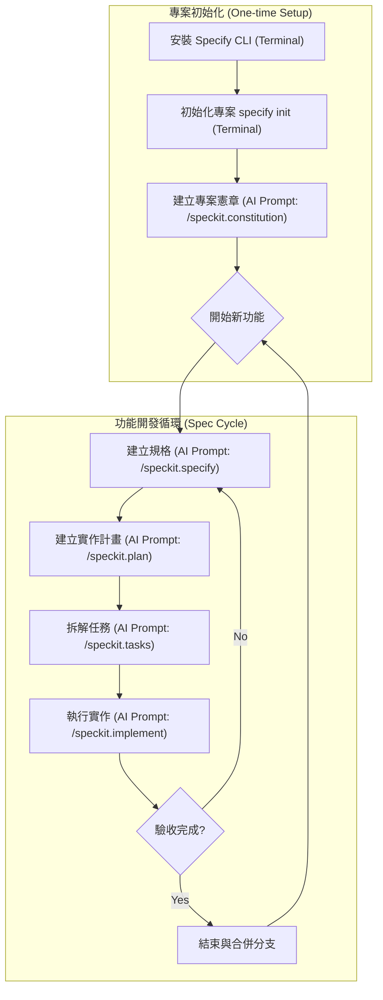

```mermaid
graph TD
    subgraph "專案初始化 (One-time Setup)"
        Install["安裝 Specify CLI (Terminal)"] --> Init["初始化專案 specify init (Terminal)"]
        Init --> Constitution["建立專案憲章 (AI Prompt: /speckit.constitution)"]
        Constitution --> StartCycle{"開始新功能"}
    end

    subgraph "功能開發循環 (Spec Cycle)"
        StartCycle --> Specify["建立規格 (AI Prompt: /speckit.specify)"]
        Specify --> Plan["建立實作計畫 (AI Prompt: /speckit.plan)"]
        Plan --> Tasks["拆解任務 (AI Prompt: /speckit.tasks)"]
        Tasks --> Implement["執行實作 (AI Prompt: /speckit.implement)"]
        Implement --> Review{"驗收完成?"}
        Review -- No --> Specify
        Review -- Yes --> Finish["結束與合併分支"]
        Finish --> StartCycle
    end
```
